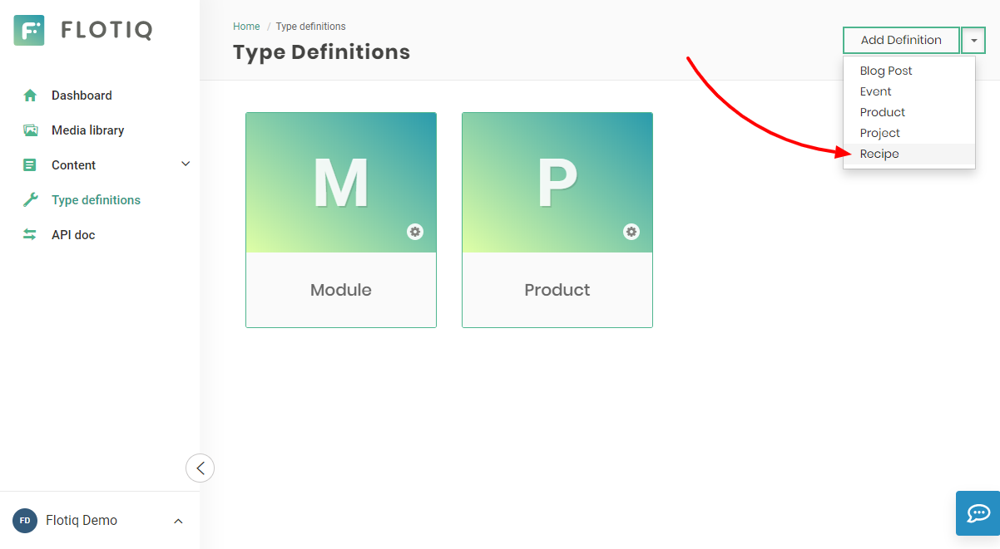

# Gatsby Starter - Recipes

A starter template to build recipes site with [Ghost](https://ghost.org) & [Gatsby](https://gatsbyjs.org)

Live Demo: https://flotiq-starter-recipes.herokuapp.com


# Quick start

1. **Start project from template using Gatsby CLI**
    
    ```bash
    gatsby new gatsby-starter-recipes https://github.com/flotiq/gatsby-starter-recipes.git
    ```
1. **Setup "Recipe" Content Type in Flotiq**

   Create your [Flotiq.com](https://flotiq.com) account. Next, create the `Recipe` Content Type:

   
    
   _Note: You can also create `Recipe` using [Flotiq REST API](https://flotiq.com/docs/API/)._ 

1. **Configure application**

    The next step is to configure our application to know from where it has to fetch the data.
       
    You need to create a file called `.env` inside the root of the directory, with the following structure:

    ```
    GATSBY_FLOTIQ_BASE_URL="https://api.flotiq.com"
    FLOTIQ_API_KEY="YOUR FLOTIQ API KEY"
    ```

1.  **Start developing**

    Navigate into your new site’s directory and start it up.

    ```sh
    cd gatsby-starter-recipes
    npm install
    gatsby develop
    ```
   
1.  **Open the source code and start editing!**
    
    Your site is now running at `http://localhost:8000`!
    
    _Note: You'll also see a second link: _`http://localhost:8000/___graphql`_. This is a tool you can use to experiment with querying your data. Learn more about using this tool in the [Gatsby tutorial](https://www.gatsbyjs.org/tutorial/part-five/#introducing-graphiql)._
    
    Open a project directory in your code editor of choice and edit `src/templates/index.js`. Save your changes and the browser will update in real time!

1. **Manage your recipes using Flotiq editor**
      
    You can easily manage your recipes using Flotiq editor
    
    

  ## Deploy

  You can deploy this project to Heroku in 3 minutes:

  [](https://heroku.com/deploy?template=https://github.com/flotiq/gatsby-starter-recipes)
